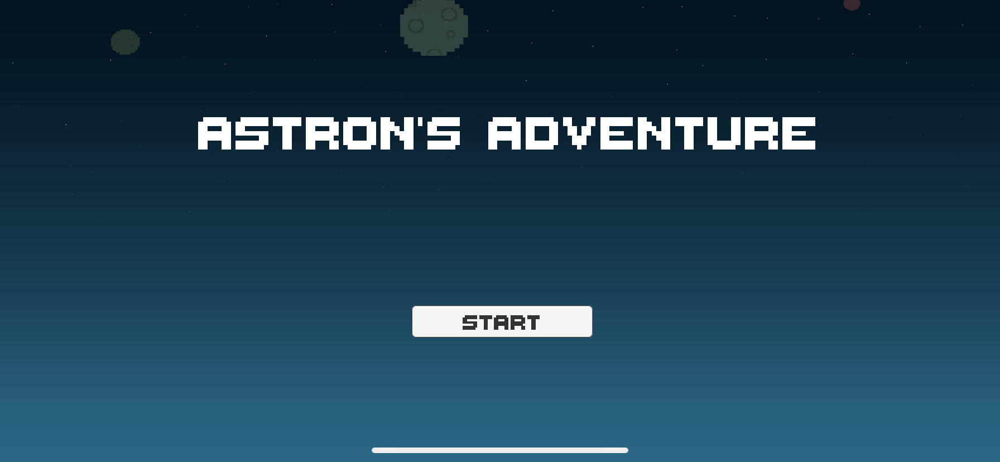
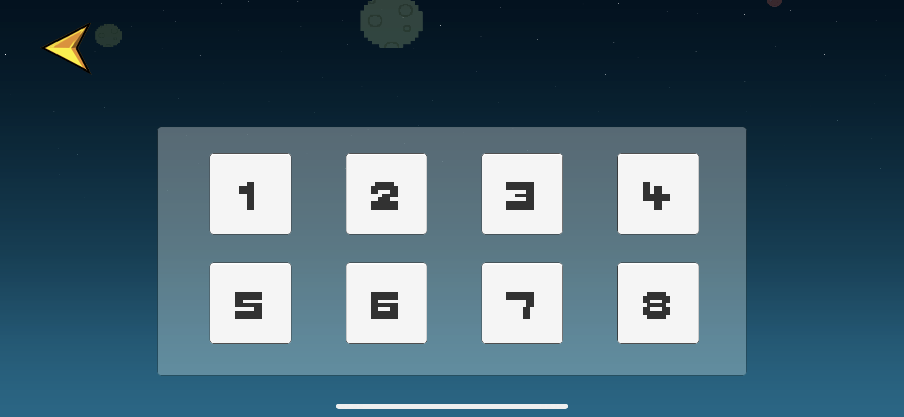
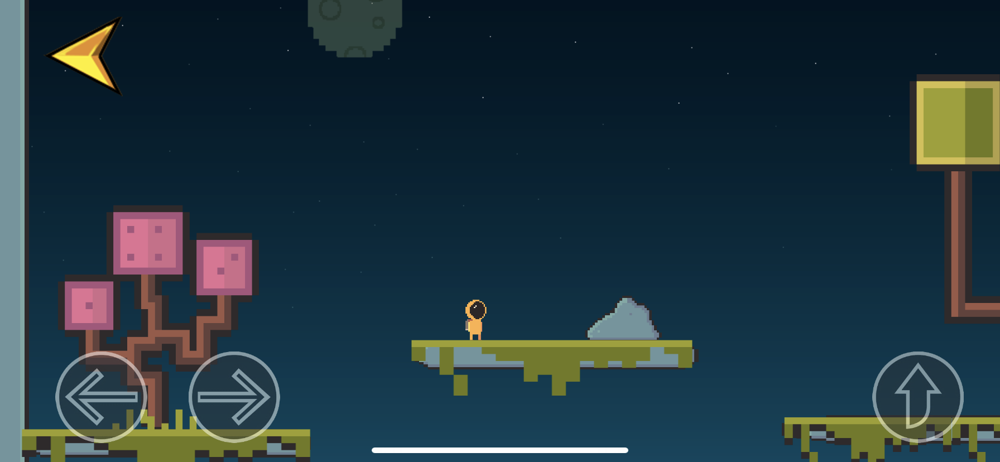

# Astron-s-Adventure
我的第一个unity2d游戏项目~~甚至连项目名都还是系统默认的~~
适用于移动平台

- [玩法介绍](#玩法介绍)
- [游戏截图](#游戏截图)
- [所学技术](#所学技术)
- [所用资源](#所用资源)
- [联系方式](#联系方式)

## 玩法介绍
- 通过虚拟按钮控制阿斯特的移动和跳跃，到达传送门即可。

## 游戏截图
- 开始页面
 
- 关卡选择页面
 
- 第一关中的游戏截图
 
*仅展示第一关的游戏内容，如有兴趣可以克隆项目跑一下试试*

## 所学技术
- 对unity3d的初识，了解了资源的导入
- 了解了全局音乐控制器的用法**unity中单例的用法**
- 通过脚本控制角色行动 ~~然而脚本写的很杂乱，下次一定改orz~~
- 使用`SceneManager`进行场景的切换
- 相机的跟随
- 动画以及动画触发器的使用

## 所用资源
1. 来自[爱给网](http://www.aigei.com/)音频资源
2. 来自unity AssetStore的免费资源

## 联系方式
- 邮箱:739296759@qq.com
